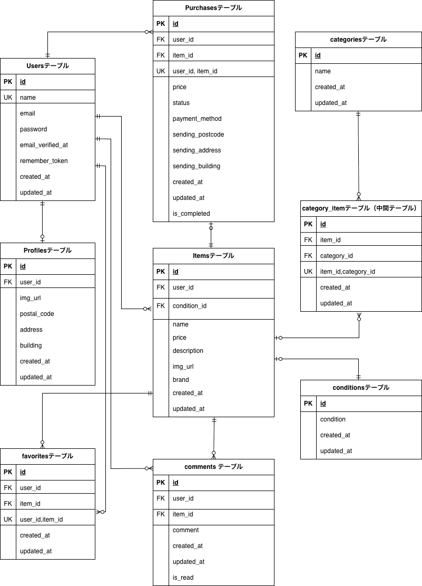

# coachtechフリマ（模擬案件）
COACHTECH の模擬案件として作成した
フリーマーケットアプリケーションです。
ユーザー登録（メール認証も含む）、商品出品、購入、コメント、お気に入り、
Stripe を利用した決済機能など、課題要件を満たす機能を一通り実装しています。

※ 本READMEは、環境構築手順・動作確認方法・設計資料の参照を目的として記載しています。
## 環境構築手順

## 1 リポジトリのクローン
```bash
git clone git@github.com:yurinaniko/coachtech-flea-market.git
cd coachtech-flea-market
```
## 2 Docker 起動
```bash
docker compose up -d --build
```
## 3 PHP コンテナに入る
```bash
docker compose exec php bash
```
## 4 依存関係のインストール（Composer）
```bash
composer install
```
## 5 .env ファイル作成
```bash
cp .env.example .env
php artisan key:generate
```
## 6 .env 設定
### ① アプリケーション設定
```env
APP_NAME=coachtechフリマ
APP_ENV=local
APP_DEBUG=true
APP_URL=http://localhost
```
### ② データベース設定（Docker）
```env
DB_CONNECTION=mysql
DB_HOST=mysql
DB_PORT=3306
DB_DATABASE=laravel_db
DB_USERNAME=laravel_user
DB_PASSWORD=laravel_pass
```
### ③　 メール設定（MailHog）
```env
MAIL_MAILER=smtp
MAIL_HOST=mailhog
MAIL_PORT=1025
MAIL_USERNAME=null
MAIL_PASSWORD=null
MAIL_ENCRYPTION=null
MAIL_FROM_ADDRESS=test@example.com
MAIL_FROM_NAME="coachtechフリマ"
```
### ④ Stripe（テスト環境）
#### Stripe Webhook 設定
Stripe Webhookは、決済完了などのイベントをサーバー側で受け取り、
購入状態を更新するために使用します。

1. APIキーの取得

  ※ StripeのAPIキーは各自のテスト環境のものを使用してください。
  ※ クローン直後はダミーキーが設定されているため、そのままでは決済は動作しません。
  必ず各自のStripeテストキーに置き換えてください。

  取得方法：
- https://dashboard.stripe.com/test/apikeys にアクセスする
- 画面左下の開発者クリック→ APIキークリック　→公開可能キーとシークレットキーをコピーする。

3. Webhook（ローカル環境）
ローカル環境では Stripe CLI を使用してWebhookを受信します。
コマンドをvscodeで入力する。
```bash
stripe listen --forward-to http://localhost:8000/stripe/webhook
```
実行後、以下のような署名シークレットが表示されます。
```bash
whsec_xxxxxxxxxxxxx
```
これを.envのSTRIPE_WEBHOOK_SECRETに貼付する。

3. .env に以下を設定
```env
STRIPE_KEY=pk_test_xxxxxxxxxxxxxxxxx
STRIPE_SECRET=sk_test_xxxxxxxxxxxxxxxxx
STRIPE_WEBHOOK_SECRET=whsec_xxxxxxxxxxxxxxxxx

※ STRIPE_WEBHOOK_SECRET はWebhookの署名検証に使用します。
ローカル環境では必須ではありませんが、セキュリティ上は設定することを推奨します。

- 公開可能キー → STRIPE_KEY（pk_test_...）
- シークレットキー → STRIPE_SECRET（sk_test_...）
- Webhook署名キー → STRIPE_WEBHOOK_SECRET
  → Webhook署名シークレット（whsec_...）
  ※ Stripe CLI（stripe listen）実行時に取得

※ Stripe のキーは各自の **テスト用 API キー** を設定してください。
（本番キーは使用しません）
```
- ※ Stripe Webhook はローカル環境では実際の受信確認までは行っていませんが、
Checkout セッション作成および購入ステータス更新処理まで実装しています。

## 7 Stripeキー設定反映（キャッシュクリア）

.env にStripeキーを設定後、Laravelのキャッシュをクリアします。

※ .envの変更はキャッシュされるため、この操作を行わないと反映されません。

```bash
php artisan cache:clear
```
## 8 データベース初期化（マイグレーション & シーディング）
```bash
php artisan migrate:fresh --seed
```
## 9 画像表示設定
本アプリでは、storage/app/public 配下の画像をブラウザから表示するために、
シンボリックリンク（公開用リンク）を作成する必要があります。

※ この設定を行わないと、商品画像・プロフィール画像が表示されません。

以下のコマンドを実行してください。

```bash
php artisan storage:link
```
※ storage/app/public に保存された画像を
public/storage から参照できるようにするための設定です。
## 10 アプリケーション確認
以下のURLにアクセスすると、アプリケーションが表示されます。
```
http://localhost:8000
```
## 備考
※（M1 / M2 Mac）
本プロジェクトでは、Apple Silicon（M1 / M2 Mac）環境でも
問題なく動作するよう、docker-compose.yml にて
ARM64 対応の Docker image を使用しています。
```yaml
mysql:
  image: arm64v8/mysql:8.0
  platform: linux/arm64/v8
```
そのため、M1 / M2 Mac 環境でも
追加設定なしで Docker を起動できます。

## 11 動作確認用情報

### ■ テストユーザー

Seederにより、以下のユーザーを作成しています。

```
Email：test@test.com
Password：password
```

※メール認証済み状態で作成されています。
このユーザーは商品の紐付きはありません。

---

### ■ 商品表示について

Seederでは10件の商品を作成しています.
---

### ■ チャット機能の確認方法

1. テストユーザーでログイン
2. 商品を購入
3. マイページ → 「取引中」タブ
4. 商品を選択するとチャット画面が表示されます

※Seederにより一部取引データ・チャットデータも作成されています。
(出品者Aと出品者Bにはダミーチャットデータあり)

## ダミーデータについて

本アプリでは、動作確認のために以下のダミーデータを用意しています。
※ 本ダミーデータにより、ログイン後すぐに取引チャット・評価機能の動作確認が可能です。

---

### ■ ユーザー

| 種別         | 名前      | メールアドレス                                           | パスワード    |
| ---------- | ------- | ------------------------------------------------- | -------- |
| 出品者A       | 出品者A    | [seller1@test.com] | password |
| 出品者B       | 出品者B    | [seller2@test.com] | password |
| テストユーザー | テストユーザー | [test@test.com]| password |

※すべてのユーザーはメール認証済みです。
- テストユーザーは何も紐づいていません。
- 出品者Aと出品者Bはそれぞれ5つずつ商品を出品、3つの商品は出品者Aと出品者Bで取引中です。

---

### ■ 商品データ

| 商品ID | 商品名      | 価格      | 説明                  | 画像                     | 状態         | 出品者  |
| ---- | -------- | ------- | ------------------- | ---------------------- | ---------- | ---- |
| CO01 | 腕時計      | 15,000円 | スタイリッシュなデザインのメンズ腕時計 | dummy/watch.jpeg       | 良好         | 出品者A |
| CO02 | HDD      | 5,000円  | 高速で信頼性の高いハードディスク    | dummy/hdd.jpeg         | 目立った傷や汚れなし | 出品者A |
| CO03 | 玉ねぎ3束    | 300円    | 新鮮な玉ねぎ3束のセット        | dummy/onion.jpeg       | やや傷や汚れあり   | 出品者A |
| CO04 | 革靴       | 4,000円  | クラシックなデザインの革靴       | dummy/shoes.jpeg       | 状態が悪い      | 出品者A |
| CO05 | ノートPC    | 45,000円 | 高性能なノートパソコン         | dummy/laptop.jpeg      | 良好         | 出品者A |
| CO06 | マイク      | 8,000円  | 高音質のレコーディング用マイク     | dummy/mike.jpeg        | 目立った傷や汚れなし | 出品者B |
| CO07 | ショルダーバッグ | 3,500円  | おしゃれなショルダーバッグ       | dummy/bag.jpeg         | やや傷や汚れあり   | 出品者B |
| CO08 | タンブラー    | 500円    | 使いやすいタンブラー          | dummy/tumbler.jpeg     | 状態が悪い      | 出品者B |
| CO09 | コーヒーミル   | 4,000円  | 手動のコーヒーミル           | dummy/coffee-mill.jpeg | 良好         | 出品者B |
| CO10 | メイクセット   | 2,500円  | 便利なメイクアップセット        | dummy/makeup.jpeg      | 目立った傷や汚れなし | 出品者B |

---

### ■ 取引データ（チャット用）

以下の取引データを用意しています。

* 出品者A / 出品者B とそれぞれ取引が発生
* 各取引に対してチャットメッセージを複数登録済み

---

### ■ チャット機能の確認方法

1. テストユーザーでログイン
2. 商品を購入（またはSeederで購入済）
3. マイページ → 「取引中」タブをクリック
4. 該当商品を選択するとチャット画面が表示される

---

※Seederは環境構築手順内で実行されます。

### メール認証（MailHog）
開発環境では MailHog を使用しています。
```
アプリ： http://localhost:8000

MailHog： http://localhost:8025
```
メール認証・通知メールは MailHog 上で確認できます。
メール認証誘導画面の認証はこちらからのボタンを押すとメール認証画面（MailHog画面）に遷移されます。

## ER 図



## テーブル仕様
本アプリのテーブル設計は以下のドキュメントにまとめています。

- 公開用テーブル仕様書（Googleスプレッドシート）
  https://docs.google.com/spreadsheets/d/1WawV5RIZnWRc3QdGLYek37lFXsTvPbVhaPI3sUQbhQY/edit?usp=sharing

各テーブルの役割概要を以下にまとめています。（リポジトリ内）
- [テーブル仕様概要を見る](docs/table-spec.md)

### ユニークキー設計について

- Users テーブルでは email にユニーク制約を設定しています。

一方で、FavoritesテーブルやCategory_Itemテーブルなどの中間テーブルでは、
同一ユーザーが同一商品を重複して登録できないよう、
`user_id` と `item_id` の複合ユニークキーを設定しています。

これにより、データの整合性を保ちつつ、
アプリケーション側の重複制御をシンプルにしています。

## ルート・コントローラー・ビュー構成
画面ごとのルーティング、コントローラー、アクション対応、ビューは
以下のドキュメントにまとめています。

- 公開用ルート・コントローラー・ビュー一覧
  https://docs.google.com/spreadsheets/d/1T3pl04Rojh7BDxyX_WiL4z-hYS4srfVMADkOSNfAd9k/edit?usp=sharing

### 認証済みユーザーの場合
会員登録・メール認証・プロフィール登録後、以下の画面表示や機能を確認できます。

- 商品一覧表示
- 商品詳細表示
- マイリスト
- お気に入り登録
- コメント投稿
- マイページ画面
- プロフィール編集画面
- 商品出品画面
- 商品購入画面
- 住所変更画面
- Stripe決済
- 購入完了画面（カード払いの時のみ表示）
- 取引チャット
- 取引完了 / 相互評価
- 評価依頼メール通知（MailHog）

※ Seeder で登録済みのテストユーザーは、ログイン後すぐに上記機能を確認できます。

### 未認証ユーザーの場合
未認証のユーザーでも、以下の画面は閲覧可能です。

- ログイン画面
- 会員登録画面
- メール認証画面
- 商品一覧表示
- 商品詳細表示
※ 未認証ユーザーでも、ログイン画面・会員登録画面・メール認証誘導画面は閲覧可能です。
ただし、以下の画面遷移や機能利用できません。

- お気に入り機能
- コメント機能
- マイリスト
  タブの切り替えは可能ですが、未ログインのため
  お気に入り登録した商品は存在せず、商品は表示されません。
- プロフィール画面
- プロフィール編集画面
- 商品出品画面
- 商品購入画面
- 住所変更画面
- Stripe決済
- 購入完了画面（カード払いの時のみ表示）
- ※商品購入ボタンを押すとログイン画面に遷移されます。
- ※ヘッダーのログインボタンからもログインページに遷移します。

## 商品一覧
### ログイン済みユーザー
- 初期表示では「おすすめ」タブが選択された状態で、全商品が表示されます。
- 「おすすめ」タブでは、自分が出品した商品を除いた全商品が表示されます。
- 「マイリスト」タブを選択すると、いいね（お気に入り）登録した商品のみが表示されます。
- 商品一覧ページで入力した検索キーワードは、
  タブ（おすすめ / マイリスト）を切り替えても保持され、
  各タブ内で検索結果が反映されます。

### 未ログインユーザー
- 初期表示では「おすすめ」タブが選択された状態で、全商品が表示されます。
- 「マイリスト」タブを選択することは可能ですが、未ログインのため商品は表示されません。

## いいね（お気に入り）機能

- いいね機能は **ログインユーザーのみ** 利用可能です。
- 未ログインユーザーには、いいねボタンは表示されますが操作できません。
- **自分が出品した商品には、いいねを付けることはできません。**

### 仕様詳細
- ログイン中のユーザーが他人の商品に対して、いいねの追加・解除（トグル）を行えます。
- 自分の商品詳細ページでは、いいねボタンは非活性表示となり、操作できません。
- いいね数はリアルタイムで商品詳細画面および一覧画面に反映されます。

## コメント機能について
```
・商品詳細画面では、Seederにより初期コメントが表示されます。
・ログインユーザーが投稿したコメントは、既存コメントの下に時系列で追加表示されます。
・ログインしていないユーザーにはコメント入力欄は表示されますが、送信ボタンは無効化されており、コメントを追加することはできません。
```

## マイページ画面
ログイン後、ヘッダーのマイページボタンを押すとマイページ画面に遷移し、
以下の情報を確認できます。

初期表示では「出品した商品」の一覧が表示され、
「購入した商品」や「取引中の商品」はタブを選択することで切り替えて確認できます。

※ プロフィール画像は任意項目。未設定時はデフォルト画像を表示する。

- **出品した商品**
  自身が出品した商品の一覧が表示され、出品状況を確認できます。

- **購入した商品**
  購入済み商品の一覧が表示され、過去の購入履歴を確認できます。

- **取引中の商品**
  取引中の商品の一覧が表示され、過去の購入履歴を確認できます。

## バリデーションについて

## バリデーション設計
- 会員登録画面とログイン画面
Fortifyは内部でFormRequest（LoginRequest）を使用していますが、
本課題の要件にあるエラーメッセージ仕様（メール形式エラー時も同一メッセージを表示）と一致しないため、
LoginUser内で独自にバリデーション制御を実装しています。
なお、Fortifyの標準バリデーションは利用せず、
要件に完全準拠した挙動を優先しています。
これらの挙動についてはFeature Testにて検証済みです。
- その他の画面ではFormrequestを使用しています。

## 使用技術
- 種類	バージョン
- PHP	8.x
- Laravel	8.x
- MySQL	8.0
- Nginx	1.25
- Docker / Docker Compose	最新
- Stripe	テスト環境
- MailHog	開発用
- phpMyAdmin	使用

## 機能一覧
- 機能一覧
- 会員登録 / メール認証（MailHog） / プロフィール登録（画像アップロード）
- ログイン
- プロフィール編集（画像アップロード）
- 商品出品
- 商品一覧 / 詳細表示
- お気に入り登録
- コメント投稿
- 商品購入（Stripe 決済）
- マイページ（出品した商品 / 購入した商品/ 取引中の商品）

## 実現した応用機能
- メール認証(MailHog)
- Stripe Checkout 決済
- 画像アップロード（storage 管理）
- 中間テーブルによる多対多管理
- 商品一覧画面でのおすすめ、マイリストのページネーション・検索機能の保持
- phpMyAdmin（DB確認用）


## 追加機能について

本アプリでは、追加機能として以下を実装しました。

- 取引チャット機能
- 取引完了機能
- 購入者 / 出品者の相互評価機能
- 評価依頼メール通知機能（MailHogで確認）

## 取引チャット機能

商品購入後、購入者と出品者は取引チャットを行うことができます。

本アプリでは、支払い方法（カード / コンビニ）に関わらず、
取引チャットの利用および取引完了（評価）機能を利用可能としています。

これは、仕様書に基づき「購入者が取引完了ボタンを押下すると評価モーダルが表示される」という挙動を優先し、
シンプルな実装とするためです。

- マイページの取引中のタブから新規の通知確認できます
- 未読メッセージがある場合は取引中のタブ内にある商品に件数が表示されます
- 取引中タブの横には未読の取引チャットの合計が表示されます
- マイページの「取引中」タブから対象商品を選択すると、取引チャット画面へ遷移します
- チャットでは本文を送信できます
- 画像付きメッセージにも対応しています（画像を送信する際は本文も一緒に投稿してください）
- 投稿済みメッセージの編集、削除が可能です

※ 取引チャットは、購入者・出品者の双方が利用できます。

## 取引完了と評価機能

購入者は取引チャット画面の取引完了ボタンより取引完了を行うことができます。

- 購入者が取引完了を行うと、評価モーダルが表示されます
- 購入者が出品者を評価すると、出品者へ評価依頼メールを送信します
- 購入者は評価後、商品一覧ページに遷移されます

- 出品者は下記のMailHog（http://localhost:8025）にアクセスすることでメールを確認できます
- 出品者は取引チャット画面を開くことで評価モーダルを表示できます
- 出品者も購入者を評価することで、双方の評価が完了します
- 双方の評価完了後、取引は完了状態になり取引中のタブから消えます
  出品した商品または購入した商品タブから取引完了した商品の商品詳細は確認することができます

  ※ 取引の評価は星1~5個でつけることができます。
  ※ マイページの自分の評価の星の数はこれまでの評価の平均です。

## 評価依頼メールの確認方法（MailHog）

開発環境では MailHog を使用してメールを確認できます。

### 確認手順
1. 商品を購入し、マページから取引中のタブを選択
2. 取引中のタブ内の商品を選択し、取引チャット画面を開く
3. 購入者が取引完了を行い、出品者を評価する
4. MailHog（http://localhost:8025）にアクセスする(実際では出品者のメールアドレスに届く)
5. 出品者宛の評価依頼メールを確認する

※ 本機能は開発環境では MailHog を用いて動作確認できます。
※ 実際のメール送信サービスは使用していません。

## 今後の改善余地（実務想定）

実務においては、以下のような制御を追加することで、より現実的な仕様にすることが可能です。

- コンビニ決済（pending）の場合は、支払い完了後にのみ評価を可能にする
- Stripe Webhookを用いて、決済完了時にstatusを更新する
- status（支払い状態）とis_completed（取引状態）を明確に分離したUI設計
- 商品一覧でのsold商品の商品詳細もマイページ同様に閲覧のみできるようにする

## 追加提案（取引チャット・UX改善）

### ① 取引履歴タブの追加
現在は取引チャットの履歴が残らない設計になっているので

- 取引中タブ：進行中の取引一覧を確認できる
- 取引履歴タブ：取引完了済みの取引を履歴として取引チャットが一覧で確認できる

→ 過去のやり取りをユーザーが確認しやすくなる
### ② 評価後も閲覧可能なチャット履歴
現在は取引完了後の扱いが曖昧なため

- 取引完了後は「閲覧専用」とする
- または一定期間のみ閲覧・返信可能にする

→トラブル対応や履歴確認がしやすくなる
### ③ 評価後も返信可能な設計
現在は評価完了で取引終了としていますが、

- 評価後も一定期間チャットを継続可能にする
- または双方合意でクローズする仕組みを導入する

→より柔軟な取引体験を提供できます。

## テストについて
- 本アプリケーションでは、PHPUnit を用いた機能テスト（Feature Test）を実装しています。
- 会員登録 / ログイン / ログアウト / メール認証は Feature Test で検証済み
- 認証、商品操作、検索、お気に入り、コメント、購入処理、プロフィール更新などの主要機能について、
正常系・異常系（バリデーション、権限制御、未ログイン時の挙動）を中心にテストを作成しています。

- Docker 環境上で以下のコマンドを実行し、
**すべてのテストが PASS することを確認しています。**
※ テスト実行時は phpunit.xml にて、
キャッシュ・セッション・メールなどを
テスト用設定（array / sync）に切り替えています。

## テスト実行手順
本アプリケーションでは PHPUnit を使用しています。
テスト実行時は `.env.testing` の設定が使用されます。

1. テスト用データベースを作成
上記で指定した DB_DATABASE（例：demo_test）を、
MySQL 上に作成してください。

① MySQL コンテナに入ります、MySQL へ接続します
```bash
docker compose exec mysql bash
mysql -u root -p
```
② パスワード入力
※ MySQL の root パスワードは docker-compose.yml の MYSQL_ROOT_PASSWORD を参照してください。

③ テスト用データベースを作成
```sql
CREATE DATABASE demo_test;
SHOW DATABASES;
```
SHOW DATABASES;入力後、demo_testが作成されていれば成功です。

④ MySQLを終了する
```bash
exit
```
⑤ MySQLコンテナから出る
```bash
exit
```
2. .env.testing をテスト用に編集

### ① アプリケーション設定
```env
APP_ENV=test
APP_KEY=
```

### ② データベース設定（Docker）

```env
DB_CONNECTION=mysql_test
DB_HOST=mysql
DB_PORT=3306
DB_DATABASE=demo_test
DB_USERNAME=root
DB_PASSWORD=root

```
APP_KEY は空に設定してください。
編集後、以下のコマンドでテスト用キーを生成します。

3. PHPコンテナに入る
```bash
docker compose exec php bash
```

4. テスト用キーを生成し、設定キャッシュをクリアする
```bash
php artisan key:generate --env=testing
php artisan config:clear
```

- PHPUnit 設定
テスト実行時は .env.testing の設定に加えて、
phpunit.xml にてテスト環境用の設定を定義しています。
```xml
<server name="APP_ENV" value="testing"/>
<server name="DB_CONNECTION" value="mysql_test"/>
<server name="DB_DATABASE" value="demo_test"/>
```
これにより
・テスト実行時のみテスト用DBを使用
・本番 / 開発DBへ影響しない安全な設計
となっています。

5. マイグレーション & テスト実行
```bash
php artisan migrate:fresh --env=testing
php artisan test
```
## 工夫した点
- バリデーションエラー時の入力保持を考慮し、old() を優先する実装を行いました
- create / edit で入力保持ロジックを切り分け、UXを向上させました
- Fortifyの標準バリデーションでは要件を満たせないため、ログイン処理に独自バリデーションを実装しました
- N+1問題を防ぐため、Eager Loadingを使用しています
